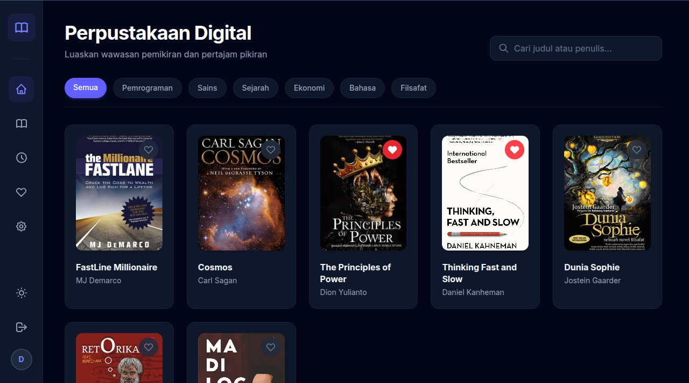
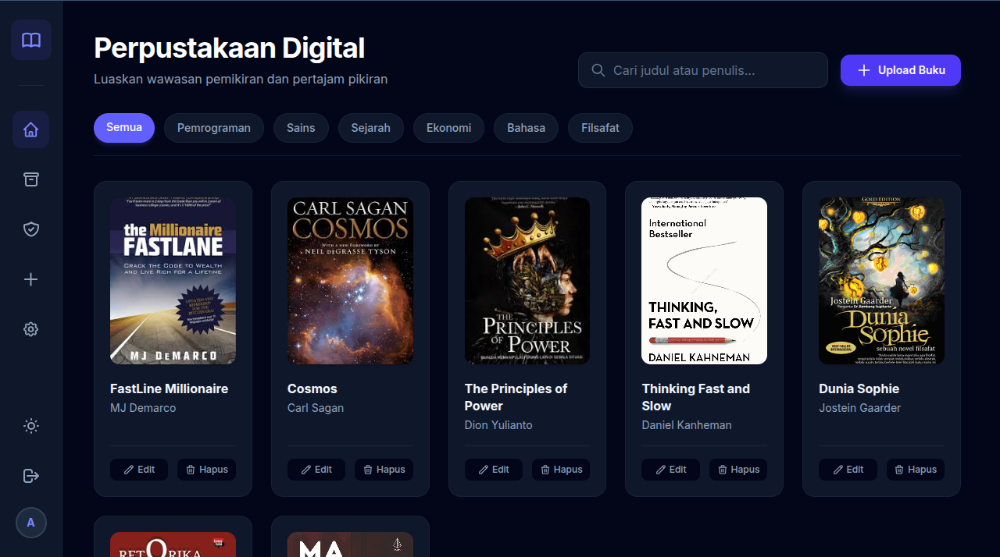
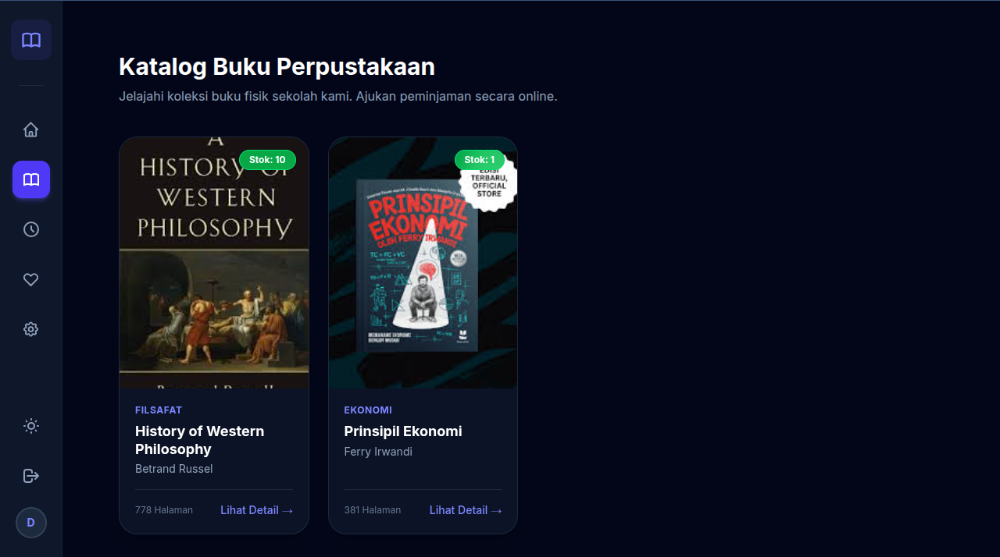
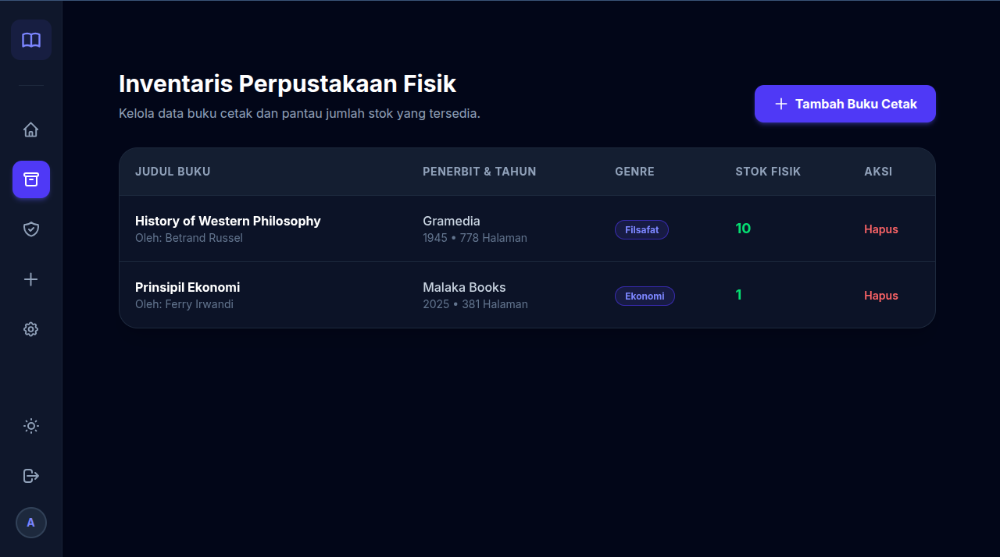
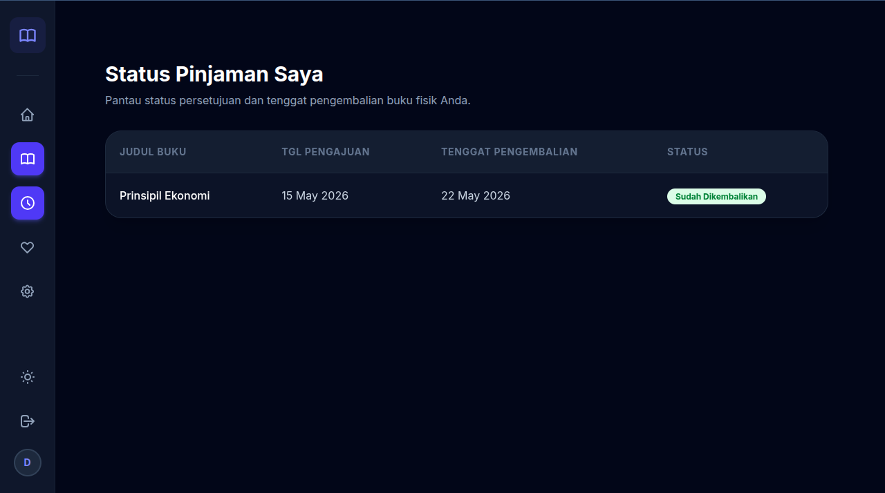
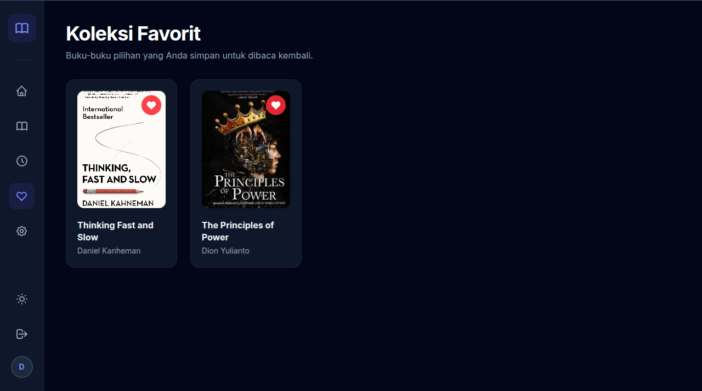
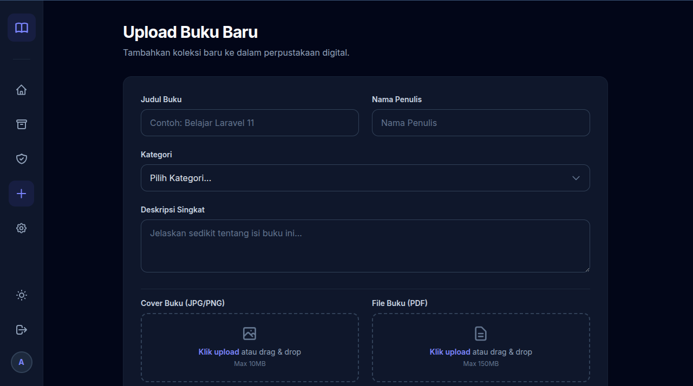

# 📚 DigiLib SMK: The Next-Gen Library Ecosystem

**DigiLib SMK** adalah platform manajemen perpustakaan terpadu yang dirancang untuk mendefinisikan ulang cara sekolah mengelola literasi. Menggabungkan kemudahan **Perpustakaan Digital** dengan ketegasan sistem **Sirkulasi Buku Fisik** dalam satu antarmuka yang modern, responsif, dan elegan.

---

## ✨ Fitur Unggulan

### 🏛️ Integrated Library Management (Physical & Digital)
Dual-ecosystem yang memungkinkan pengelolaan buku cetak dan buku digital (PDF) secara berdampingan tanpa tumpang tindih.

### 🛡️ Smart Borrowing Engine (SOP-Driven)
Alur peminjaman buku fisik yang mengadopsi standar operasional perpustakaan nyata:
* **Request & Approval System:** User mengajukan, Admin memverifikasi.
* **Auto-Stock Management:** Stok berkurang otomatis saat *Approved* dan bertambah saat *Returned*.
* **Borrowing Limit:** Sistem cerdas yang membatasi maksimal 3 peminjaman aktif per user untuk menjamin keadilan akses.

### 💎 Premium UI/UX Design
Antarmuka tingkat tinggi dengan pendekatan desain terkini:
* **Glassmorphism Layout:** Efek transparansi dan blur yang memberikan kesan mewah.
* **Bento Grid Catalog:** Tata letak katalog yang terorganisir dan informatif.
* **Seamless Theme Switching:** Dark & Light mode yang tersinkronisasi hingga ke komponen terkecil.

### 🔐 Enterprise-Grade Security
* **Role-Based Access Control (RBAC):** Pemisahan akses yang sangat ketat antara Admin dan Siswa.
* **Bcrypt Encryption:** Proteksi kredensial pengguna dengan algoritma hashing standar industri.

---

## 🛠️ Tech Stack

### Backend Powerhouse
* **Core Framework:** Laravel 12.x
* **Language:** PHP 8.5+
* **Authentication:** Laravel Breeze (Scaffolded)
* **Database:** MySQL with Eloquent ORM

### Frontend Excellence
* **Styling:** Tailwind CSS (Custom Theme)
* **Asset Bundler:** Vite
* **Interactivity:** Alpine.js & Vanilla JavaScript
* **Architecture:** Atomic Blade Components

### Environment & Tools
* **Version Control:** Git
* **Package Managers:** Composer & NPM
* **Storage:** Symlinked Local Disk Storage

---
## 🎥 Video Demo

https://github.com/user-attachments/assets/bf5126ff-42a4-4f91-95dd-2120e24c7f6b

## 📸 Screen Shoot
* **Landing Page**

 <table border="0">
  <tr>
    <td>
      
<b>Landing Page/b>

      
    </td>
    <td>
      
<b>Footer Landing Page</b>

      
    </td>
  </tr>
</table>

### 🔑 Role-Based Access Control

| User Experience (Siswa) | Admin Dashboard (Pustakawan) |
| :---: | :---: |
|  |  |
| *Dashboard yang menampilkan seluruh buku digital* | *Dashboard yang memberikan akses penuh CRUD ke pada Pustakawan* |

| Katalog BUku(Siswa) | Data Buku (Pustakawan) |
| :---: | :---: |
|  |  |
| *Katalog buku dengan opsi pinjam buku fisik* | *Panel manajemen stok, riwayat sirkulasi, & upload.* |

| Riwayat Peminjaman (Siswa) | Riwayat Peminjaman (Pustakawan) |
| :---: | :---: |
|  |  |
| *Riwayat peminjaman buku user* | *Monitoring seluruh riwayat peminjaman buku dari seluruh anggota* |

| Add buku favorit (Siswa) | Tambahkan Buku (Pustakawan) |
| :---: | :---: |
|  |  |
| *Buku digital favorit bagi user* | *Akses penuh menambahkan data buku* |

---

## 👥 Tim Pengembang

Projek **DigiLib SMK** ini dikembangkan dengan penuh dedikasi oleh **[Kelompok 10]** sebagai bagian dari [ Project Laravel / KK 3(Pemrograman Web) / DigilibSMK(Perpustakaan Digital) ]:

| Absen | Nama Anggota | Peran |
| :--- | :--- | :--- |
| **22** | **[Muhammad Haikal Afwan]** | Lead Developer / Full Stack |
| **23** | **[Muhammad Khoerudin]** | UI/UX Designer / Frontend |
| **7** | **[Dhafin Naufal Ridwan]** | Idea Project / QA |

---

  Copyright &copy; 2026 <b>[Kelompok 10]</b>.  
  Semua hak cipta dilindungi. Dibangun untuk kemajuan literasi sekolah.

